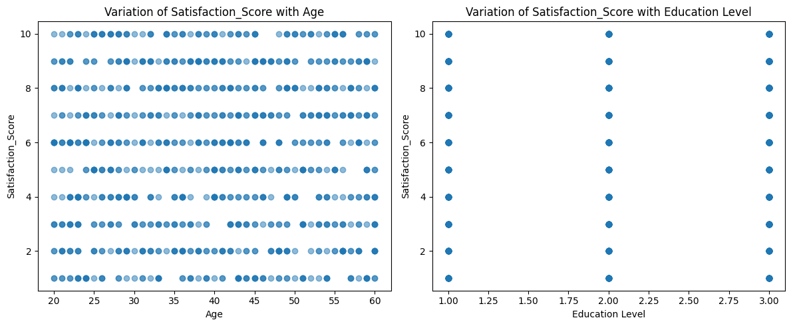
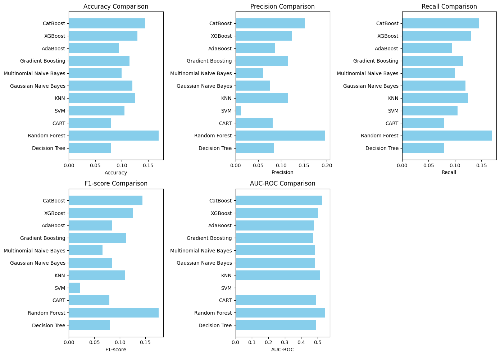

# 12 algorithms of classification in machine learning


```python
import pandas as pd
import matplotlib.pyplot as plt
from sklearn.tree import DecisionTreeClassifier
from sklearn.ensemble import RandomForestClassifier, GradientBoostingClassifier, AdaBoostClassifier
from sklearn.svm import SVC
from sklearn.neighbors import KNeighborsClassifier
from xgboost import XGBClassifier
from lightgbm import LGBMClassifier
from sklearn.model_selection import train_test_split
from sklearn.metrics import accuracy_score
from sklearn.preprocessing import LabelEncoder
from catboost import CatBoostClassifier
from faker import Faker  # Install faker: pip install Faker
from sklearn.naive_bayes import GaussianNB, MultinomialNB
from sklearn.model_selection import train_test_split
from sklearn.metrics import accuracy_score, precision_score, recall_score, f1_score, roc_auc_score
import matplotlib.pyplot as plt
from sklearn.preprocessing import LabelEncoder


# Generating more imaginary customer data using Faker
fake = Faker()
num_samples = 1000  # Increase the number of samples

data = {
    'Age': [fake.random_int(20, 60) for _ in range(num_samples)],
    'Gender': [fake.random_element(['Male', 'Female']) for _ in range(num_samples)],
    'Education': [fake.random_element(['Graduate', 'Postgraduate', 'Undergraduate']) for _ in range(num_samples)],
    'Salary': [fake.random_int(40000, 120000) for _ in range(num_samples)],
    'Country': [fake.random_element(['USA', 'UK', 'Canada']) for _ in range(num_samples)],
    'Satisfaction_Score': [fake.random_int(1, 10) for _ in range(num_samples)]
}

# Creating a DataFrame
df = pd.DataFrame(data)

# Plotting variations between 'Satisfaction_Score' and 'Age', 'Education'
plt.figure(figsize=(12, 5))

plt.subplot(1, 2, 1)
plt.scatter(df['Age'], df['Satisfaction_Score'], alpha=0.5)
plt.xlabel('Age')
plt.ylabel('Satisfaction_Score')
plt.title('Variation of Satisfaction_Score with Age')

plt.subplot(1, 2, 2)
edu_map = {'Graduate': 3, 'Postgraduate': 2, 'Undergraduate': 1}
df['Education'] = df['Education'].map(edu_map)
plt.scatter(df['Education'], df['Satisfaction_Score'], alpha=0.5)
plt.xlabel('Education Level')
plt.ylabel('Satisfaction_Score')
plt.title('Variation of Satisfaction_Score with Education Level')

plt.tight_layout()
plt.show()

# Convert categorical variables to numerical using one-hot encoding
df = pd.get_dummies(df, columns=['Gender', 'Country'])

# Label encoding for 'Satisfaction_Score'
label_encoder = LabelEncoder()
df['Satisfaction_Score'] = label_encoder.fit_transform(df['Satisfaction_Score'])

# Splitting data into features and target variable
X = df.drop('Satisfaction_Score', axis=1)
y = df['Satisfaction_Score']

# Splitting the data into training and testing sets
X_train, X_test, y_train, y_test = train_test_split(X, y, test_size=0.2, random_state=42)

# Initialize classifiers including Decision Tree, Random Forest, CART, Gaussian Naive Bayes, and Multinomial Naive Bayes
classifiers = {
    'Decision Tree': DecisionTreeClassifier(),
    'Random Forest': RandomForestClassifier(),
    'CART': DecisionTreeClassifier(),  # CART is essentially a Decision Tree
    'SVM': SVC(),
    'KNN': KNeighborsClassifier(),
    'Gaussian Naive Bayes': GaussianNB(),
    'Multinomial Naive Bayes': MultinomialNB(),
    'Gradient Boosting': GradientBoostingClassifier(),
    'AdaBoost': AdaBoostClassifier(),
    'XGBoost': XGBClassifier(),
    'CatBoost': CatBoostClassifier(verbose=0),
}

# Dictionary to store metric scores for each classifier
metrics = {
    'Accuracy': {},
    'Precision': {},
    'Recall': {},
    'F1-score': {},
    'AUC-ROC': {}
}

for name, clf in classifiers.items():

    clf.fit(X_train, y_train)
    y_pred = clf.predict(X_test)

    # Calculate metrics
    acc = accuracy_score(y_test, y_pred)
    precision = precision_score(y_test, y_pred, average='weighted')
    recall = recall_score(y_test, y_pred, average='weighted')
    f1 = f1_score(y_test, y_pred, average='weighted')

    auc_roc = None
    if hasattr(clf, "predict_proba"):
        y_prob = clf.predict_proba(X_test)
        auc_roc = roc_auc_score(y_test, y_prob, multi_class='ovr')

    # Store metric scores
    metrics['Accuracy'][name] = acc
    metrics['Precision'][name] = precision
    metrics['Recall'][name] = recall
    metrics['F1-score'][name] = f1
    metrics['AUC-ROC'][name] = auc_roc if auc_roc is not None else None

    # Print metric parameters
    print(f"Classifier: {name}")
    print(f"Accuracy: {acc}")
    print(f"Precision: {precision}")
    print(f"Recall: {recall}")
    print(f"F1-score: {f1}")
    print(f"AUC-ROC: {auc_roc}\n")

# Plotting metrics comparison for each classifier
plt.figure(figsize=(14, 10))

for i, (metric, scores) in enumerate(metrics.items()):
    plt.subplot(2, 3, i+1)
    auc_roc_scores = [score if score is not None else 0 for score in scores.values()]  # Replace None with 0 for plotting
    plt.barh(list(scores.keys()), auc_roc_scores, color='skyblue')
    plt.xlabel(metric)
    plt.title(f'{metric} Comparison')

plt.tight_layout()
plt.show()

```


    

    


    Classifier: Decision Tree
    Accuracy: 0.08
    Precision: 0.08496241184220724
    Recall: 0.08
    F1-score: 0.08068290530790531
    AUC-ROC: 0.4885384063310491
    
    Classifier: Random Forest
    Accuracy: 0.17
    Precision: 0.19714648104899526
    Recall: 0.17
    F1-score: 0.17634386200120436
    AUC-ROC: 0.5470634933082328
    
    Classifier: CART
    Accuracy: 0.08
    Precision: 0.08165037878787879
    Recall: 0.08
    F1-score: 0.07940696042308946
    AUC-ROC: 0.4897176458395813
    
    Classifier: SVM
    Accuracy: 0.105
    Precision: 0.012222222222222221
    Recall: 0.105
    F1-score: 0.0218957345971564
    AUC-ROC: None
    
    Classifier: KNN
    Accuracy: 0.125
    Precision: 0.11580176359588125
    Recall: 0.125
    F1-score: 0.11009442117022765
    AUC-ROC: 0.5153755602908262
    
    Classifier: Gaussian Naive Bayes
    Accuracy: 0.12
    Precision: 0.07588810641627543
    Recall: 0.12
    F1-score: 0.08500733137829912
    AUC-ROC: 0.4850256345913276
    
    Classifier: Multinomial Naive Bayes
    Accuracy: 0.1
    Precision: 0.060554356060606065
    Recall: 0.1
    F1-score: 0.06575662304111525


    /usr/local/lib/python3.10/dist-packages/sklearn/metrics/_classification.py:1344: UndefinedMetricWarning: Precision is ill-defined and being set to 0.0 in labels with no predicted samples. Use `zero_division` parameter to control this behavior.
      _warn_prf(average, modifier, msg_start, len(result))
    /usr/local/lib/python3.10/dist-packages/sklearn/metrics/_classification.py:1344: UndefinedMetricWarning: Precision is ill-defined and being set to 0.0 in labels with no predicted samples. Use `zero_division` parameter to control this behavior.
      _warn_prf(average, modifier, msg_start, len(result))
    /usr/local/lib/python3.10/dist-packages/sklearn/metrics/_classification.py:1344: UndefinedMetricWarning: Precision is ill-defined and being set to 0.0 in labels with no predicted samples. Use `zero_division` parameter to control this behavior.
      _warn_prf(average, modifier, msg_start, len(result))


    AUC-ROC: 0.4819291856280469
    
    Classifier: Gradient Boosting
    Accuracy: 0.115
    Precision: 0.11479860531218768
    Recall: 0.115
    F1-score: 0.11273005552089176
    AUC-ROC: 0.4709103127429741
    
    Classifier: AdaBoost
    Accuracy: 0.095
    Precision: 0.08662223522091943
    Recall: 0.095
    F1-score: 0.08549399973670703
    AUC-ROC: 0.47895679928547386
    
    Classifier: XGBoost
    Accuracy: 0.13
    Precision: 0.12450045826206818
    Recall: 0.13
    F1-score: 0.1255578562325523
    AUC-ROC: 0.502266433266126
    
    Classifier: CatBoost
    Accuracy: 0.145
    Precision: 0.15282967498439903
    Recall: 0.145
    F1-score: 0.1445803158965349
    AUC-ROC: 0.5291227165813034
    


    

    


```python

```
